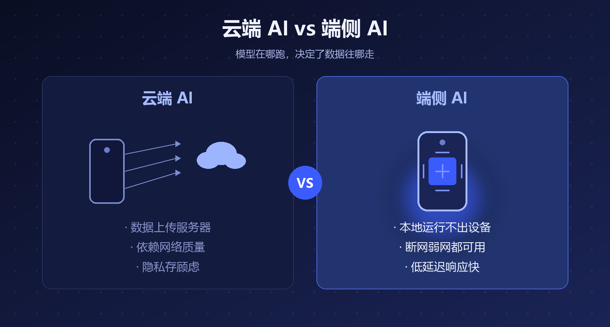
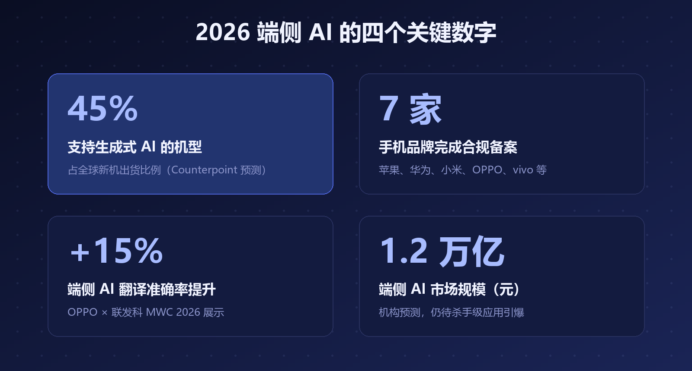
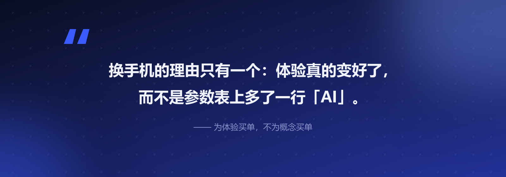

# 大模型装进手机之后：2026 年的 AI 手机，到底改变了什么

先说一个很多人没注意到的事：**今年 7 月 15 日，国家网信办公示了 7 款手机端侧生成式 AI 完成合规备案**——苹果、华为、小米、OPPO、vivo、三星、努比亚，主流厂商几乎全部在列。

一件东西要"合规备案"，说明它已经不是概念，而是大规模上市的前奏。

再叠加一个数据：Counterpoint 预测，**2026 年支持生成式 AI 的机型将占全球智能手机出货量的 45%**。也就是说，你下一部换的手机，大概率就是 AI 手机。

## 一、什么是"端侧 AI"：模型装进手机里跑

过去手机上的 AI（语音助手、相册分类），本质是"上传—云端处理—返回"：你的数据要出设备、走网络、进厂商的服务器。

**端侧 AI 是把模型直接装进手机本地跑**——模型权重和计算都留在设备上。

▲ 图1 · 云端 AI 与端侧 AI 的本质区别

这一变，解决的是两大老痛点：

- **隐私**：数据不出设备，敏感照片、聊天记录、日程不必上传
- **可用性**：断网、弱网、飞机上，AI 照常工作，而且响应更快

## 二、2026 年，行业走到了哪一步

三个标志性事件，串起了今年的主线：

- **合规化**：7 月，7 大品牌端侧生成式 AI 集体完成备案，端侧 AI 进入"有证上岗"阶段
- **软硬协同**：36 氪的分析指出，端侧模型正从"压缩变小"走向与芯片、系统、场景的深度配合——OPPO 与联发科在 MWC 2026 展示的端侧 AI 翻译，准确率较传统方案平均提升 15%，弱网无网环境可用
- **系统重构**：Google I/O 2026 上，Android 明确了从操作系统向"智能系统"的转变方向，AI 体验开始进入系统底层

▲ 图2 · 2026 端侧 AI 的四个关键数字

一句话总结：端侧 AI 从去年的"能跑"，进入了今年的"**合规化、规模化、软硬协同**"阶段。

## 三、冷思考：万亿市场，还差一口气

市场预测喊到了 1.2 万亿元，但也有冷静的声音：端侧 AI 的爆发"还差一口气"——

- **杀手级应用还没出现**：目前的端侧 AI 多是摘要、修图、翻译这类"锦上添花"，还没有"没有它就不行"的功能
- **算力与功耗的平衡**仍在爬坡：小模型的能力天花板、发热与续航，都是真实约束
- **体验同质化**：各家宣传的 AI 功能高度雷同，消费者很难感知差异

> 换手机的理由，最终只有一个：体验真的变好了。而不是参数表上多了一行"AI"。

## 写在最后

对普通消费者，我的建议很朴素：**为体验买单，不为概念买单**。

下次换机时，别问"是不是 AI 手机"，去店里实际试三个东西：断网时助手还能不能用、AI 修图快不快、发热控不控得住。这三件事过关，AI 手机才真的配叫元年。

---

**参考资料**

- 腾讯新闻 / 搜狐：Counterpoint 2026 年 GenAI 手机出货占比预测
- 知乎专栏《7 大品牌获批：一文读懂端侧 AI 大模型技术、生态与前景》
- 36 氪《2026"端侧 AI 战事"升级，苹果谷歌们在拼什么？》
- OPPO 官网：MWC 2026 OPPO × 联发科端侧 AI 合作
- Android 开发者官网：Google I/O 2026 相关内容

---

*本文由 AI 内容流水线生成，人工审核后发布。觉得有用的话，点个「在看」和「关注」，每天一条 AI 圈有价值的动态。*
