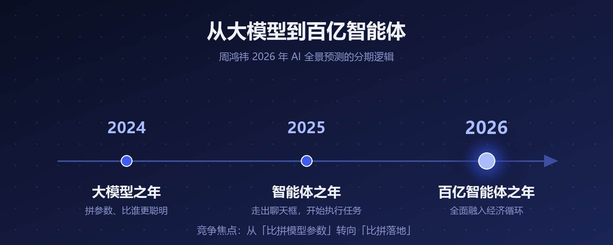
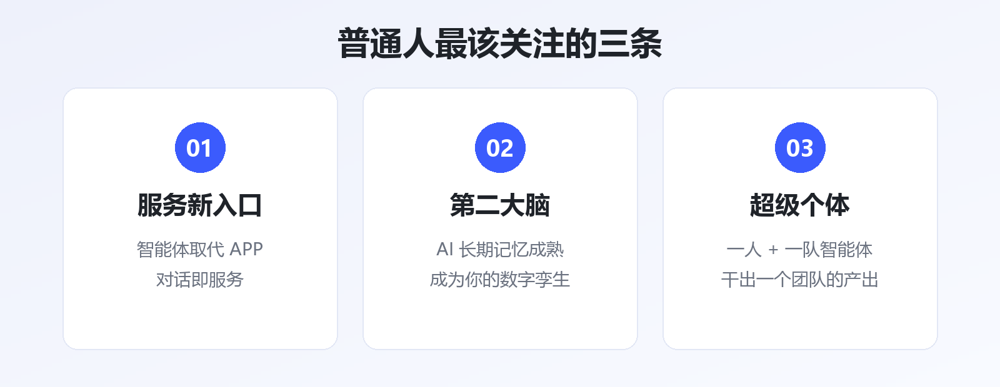
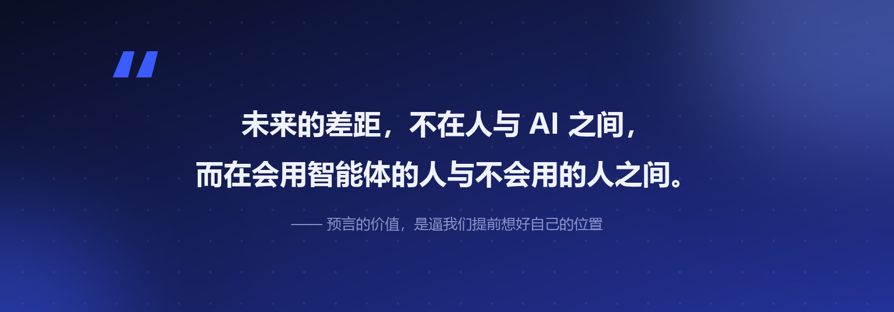

# 周鸿祎的 20 个 AI 预言：百亿智能体时代，普通人该关心什么

1 月 9 日，360 创始人周鸿祎在个人社交平台发了一篇长文——《2026 年 AI 全景预测：迈向百亿智能体时代的 20 个发展趋势》。

20 条预言，六大门类：算力与基础设施、模型架构与进化、智能体与群体协作、物理 AI、软件开发范式、个体与组织变革。

红衣教主的预言历来有人捧有人嘲，但这篇里确实有几条，值得每个普通人停下来想一想。我把 20 条翻完，替你挑出了最有含金量的部分。

## 一、先看懂大框架：三个年份，给 AI 划了代

周鸿祎的整篇预测，建立在一个清晰的分期逻辑上：

- **2024 年，大模型之年**——拼参数、拼刷榜，AI 比"谁更聪明"
- **2025 年，智能体之年**——AI 从聊天框里走出来，开始执行任务
- **2026 年，百亿智能体之年**——智能体数量爆炸，全面融入经济循环

▲ 图1 · 从大模型到百亿智能体的三年演进

这个分期的潜台词是：**竞争焦点变了**。行业不再比拼模型参数，而是比拼落地——谁能让智能体真正干活。

支撑这个判断的底层变化，是 AI 范式的转移：传统的"预训练 + 微调"将让位于"**通用基座 + 行业专精 + 推理时进化**"，AI 从静态工具蜕变为持续进化的系统。

## 二、20 条里，普通人最该关注这三条

**第一条：智能体将取代 APP，成为服务的新入口。**

如果智能体数量达到百亿级，你手机里一个个点开的 APP，可能会变成"对话即服务"——你说需求，智能体去办。周鸿祎把这称为商业的"第三次跃迁"，甚至提出会出现"智能体间自动化经济"：智能体替你下单，另一个智能体替商家接单。

**第二条：AI 将长出"长期记忆"，成为你的第二大脑。**

预测中提到，2026 年 AI 将具备成熟的长期记忆能力——记录、理解并深度调用你的生活与工作数据。AI 不再是"每次聊天都失忆的工具"，而是你的数字孪生、意识的延伸。

**第三条：超级个体诞生，职场生态重塑。**

一个人 + 一队智能体，可能干出过去一个团队的产出。"超级个体"这个词，2026 年会从概念变成身边真实的同事。

▲ 图2 · 20 条预言中与普通人关系最紧密的三条

## 三、冷思考：预言要打折听

对这 20 条，也有必要泼几瓢冷水：

- **立场要看见**：周鸿祎是 360 创始人，360 正在做智能体产品——预言本身自带"布道"属性
- **节奏会偏差**："取代 APP""第二大脑"这类判断方向大概率对，但一年内兑现多少要存疑；技术落地永远比宣言慢
- **已验证的部分**：推理算力需求爆发、芯片格局双轨化（英伟达守训练、多厂商分推理）这两条，与今年行业的实际走势基本吻合，含金量最高

> 看预言的正确姿势：方向当地图看，时间表当参考看，别当时刻表看。

## 写在最后

预言的价值不在"准不准"，而在逼我们提前想一个问题：**如果智能体真的大量出现，我的位置在哪？**

答案其实不新鲜——成为那个会用智能体的人。工具越强，会用工具的人与不会用的人之间的差距只会越拉越大。

---

**参考资料**

- 中国日报《周鸿祎发布 2026 年 20 个 AI 预言：我们正迈向百亿智能体时代》（2026-01-09）
- DTinsight《周鸿祎的 20 个 AI 预判：2026 迈向百亿智能体时代》
- 知乎专栏《百亿智能体浪潮将至：周鸿祎发布 2026 年 20 个 AI 预测》
- 新浪财经、证券时报相关报道

---

*本文由 AI 内容流水线生成，人工审核后发布。觉得有用的话，点个「在看」和「关注」，每天一条 AI 圈有价值的动态。*
