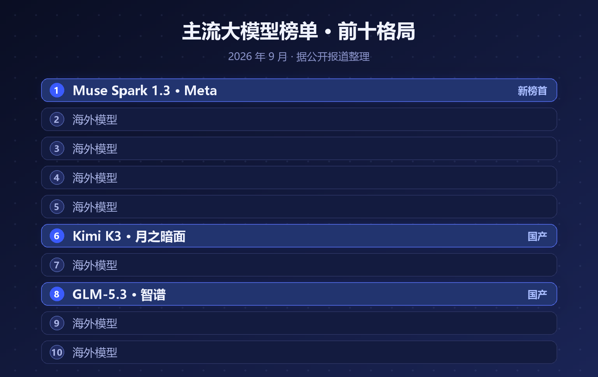
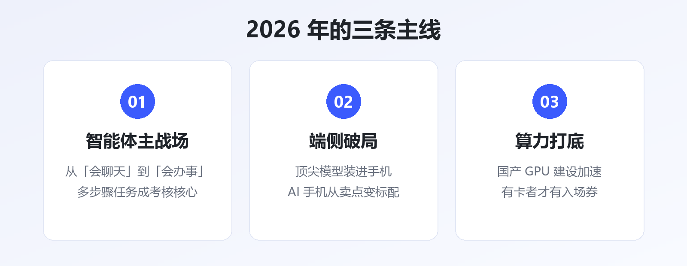
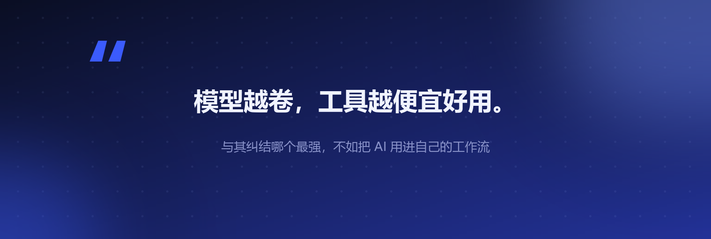

# 大模型榜单变天：Meta 三天登顶，国产杀进前十

9 月的大模型圈，出了一件不大不小、但很有信号意义的事。

9 月 2 日，Meta 上线了新模型 **Muse Spark 1.3**。三天后，它登顶了一份涵盖 30 款主流大模型的评测榜单——**第一名既不是 OpenAI，也不是 Anthropic，而是 Meta**。

更值得注意的一个细节是：**榜单前十，国产模型占了两个席位**——Kimi K3 排第 6，GLM-5.3 排第 8。

▲ 图1 · 9 月主流大模型榜单前十格局（据公开报道整理）

## 一、Meta 为什么能赢？

过去两年，"最强模型"这个词基本被 OpenAI 和 Anthropic 轮流垄断，Meta 的开源策略更多是"量大管饱"，冲刺榜首的次数不多。

这次 Muse Spark 1.3 能三天登顶，靠的主要是两项能力的大幅跃升：

- **编程能力**：代码生成与修复的成绩逼近甚至局部反超第一梯队
- **智能体（Agent）能力**：多步骤任务规划、工具调用、长程执行的稳定性明显提升

> 换句话说，2026 年的榜单竞争，重心已经从"聊天谁更聪明"转向了"**干活谁更靠谱**"。

这和整个行业的主线是一致的：今年真正落地的 AI 应用，几乎全是智能体——自动写代码、自动做调研、自动跑工作流。评测标准自然也跟着变了。

## 二、国产模型的位置：稳，但还没到庆祝的时候

Kimi K3 第 6、GLM-5.3 第 8，前十占两席——这个成绩放在两年前是不敢想的。

但也要冷静看两点：

- **头部差距仍在**：前五名依然被美国团队包揽，榜首的编程与 Agent 成绩还有明显身位差
- **榜单不等于商业**：排名往上爬是一回事，开发者生态、企业订单、算力成本是另一回事

国产模型的真正机会，可能不在"通用榜一"，而在**行业专精**——中文场景、本土合规、垂直领域的深度适配，这些是海外模型短期内难以覆盖的。

## 三、榜单背后，2026 年的三条主线

单看一次排名变化意义有限，但它指向的趋势很清晰：

- **智能体成为主战场**：模型竞争的考核项从"会聊天"变成"会办事"
- **端侧破局**：顶尖模型开始装进手机，AI 手机从营销词变成真卖点
- **算力打底**：国产 GPU 建设加速，谁有卡、谁能用好卡，谁就有下一轮的入场券

> 有业内判断认为，"预训练 + 微调"的旧范式正在让位于"**通用基座 + 行业专精 + 推理时进化**"，未来是百亿智能体的时代。

▲ 图2 · 2026 年 AI 行业的三条主线

## 写在最后

对普通人来说，这些榜单变化的意义其实很直接：**模型越卷，工具越便宜好用**。

三年前要付费订阅才能用上的能力，现在开源免费；去年还需要人工盯着的流程，今年智能体自己就能跑完。与其纠结"哪个模型最强"，不如挑一两个真实场景，把 AI 真正用进自己的工作流里。

---

**参考资料**

- 知乎专栏《30 款主流 AI 大模型，第一名有点意外》（2026-09-07）
- 钜亨网：Meta Muse Spark 1.3 发布相关报道
- 中国日报：周鸿祎 2026 年 20 个 AI 预言
- 华尔街见闻：2026 年 AI 与技术趋势

---

*本文由 AI 内容流水线生成，人工审核后发布。觉得有用的话，点个「在看」和「关注」，每天一条 AI 圈有价值的动态。*
