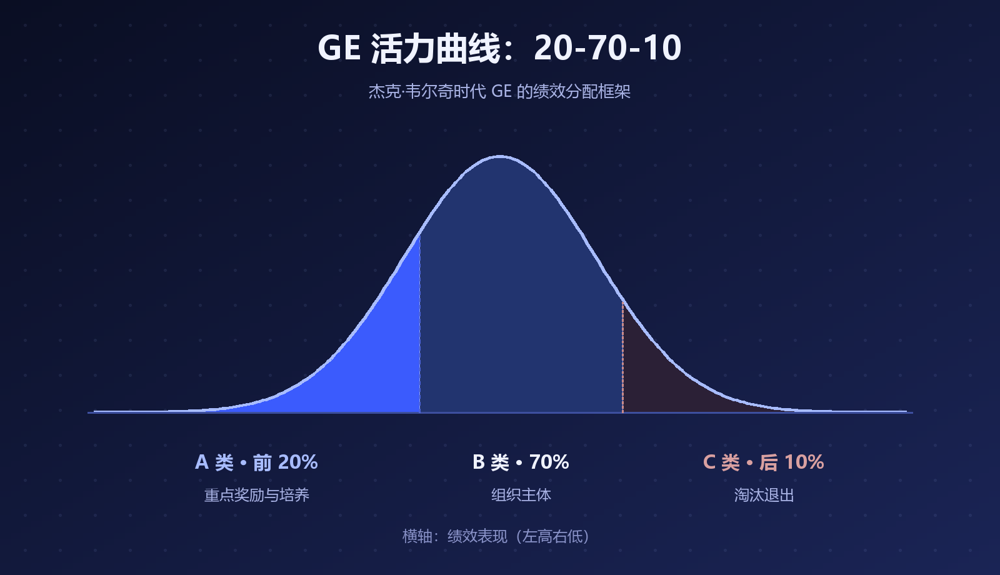
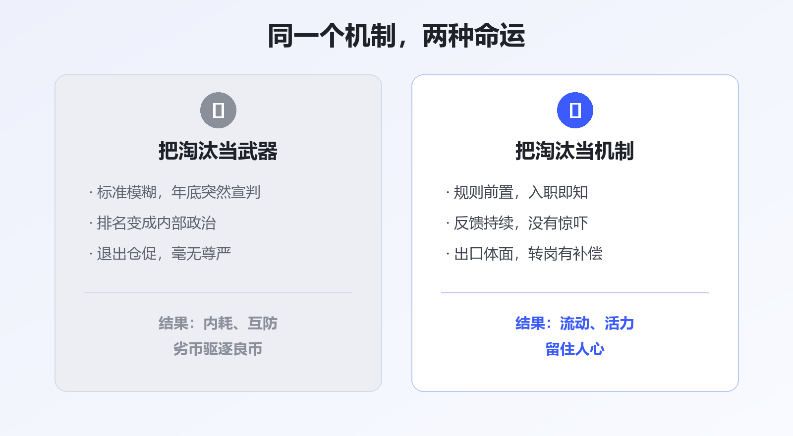

# 正视淘汰机制：好公司不装，也不滥用

每到组织调整的季节，"末位淘汰"总会以各种面目出现——有的公司写进制度里，有的藏在"优化""毕业""人员盘活"的委婉说法背后。

围绕它的争议从来没停过：有人说它是组织保持活力的必需品，有人说它是职场内耗的万恶之源。

但大多数争论其实吵错了地方。**真正的问题从来不是"要不要淘汰"，而是企业敢不敢正视它、会不会正确地使用它。**

## 一、淘汰机制有"正统出身"，但别只学一半

最有名的淘汰机制，出自杰克·韦尔奇时代的 GE——著名的**活力曲线（20-70-10）**：每年把员工区分为前 20% 的 A 类重点奖励、中间 70% 的 B 类组织主体、末位 10% 的 C 类淘汰对象。

▲ 图1 · GE 活力曲线：20-70-10 的绩效分配框架

国内践行最彻底的是华为，"干部能上能下""不是终身制"写进了组织基因。

但很多公司只看到了"淘汰 10%"这个动作，没看到韦尔奇反复强调的前提：**GE 花了大约十年，先建立起坦率、公开的绩效文化，活力曲线才有生存的土壤。**

制度是长在文化上的。把果树的枝条剪回家插在花瓶里，是结不出果子的。

## 二、执行走样的代价：微软和索尼的教训

**微软**从上世纪起对十万员工实行 1-5 级强制钟形分布的 Stack Ranking，每人必须被归入等级、每个团队必须产生"末位"。2013 年 11 月，微软正式宣布废除这套实行了十多年的制度——它被广泛批评为助长内斗、抑制协作，员工精力花在"不垫底"而不是"做出好东西"上，被认为与微软"失落的十年"难脱干系。

**索尼**的教训更深刻。2007 年，前常务董事天外伺朗发表《绩效主义毁了索尼》：因为要考核业绩，几乎所有人都只提容易实现的低目标，"挑战精神"消失了；追求眼前利益的风气蔓延，团队精神瓦解。

两个案例的共同点：**把淘汰从"结果"做成了"目的"，把绩效排名做成了内部政治。**

▲ 图2 · 同一个机制，两种命运

## 三、先划清一条法律红线

在中国，"末位淘汰"有一条清晰的司法边界。

最高人民法院 2013 年发布的**指导案例 18 号**（中兴通讯诉王鹏案）明确：**劳动者在考核中居于末位，不等于"不能胜任工作"**，用人单位不能仅以末位淘汰为由解除劳动合同——中兴通讯因此被判违法解除、支付赔偿金。

也就是说：排名靠后可以触发调岗、培训、降级等管理动作，但**"末位"本身不是解除合同的法定理由**。正视淘汰机制的第一步，是正视规则的边界。

## 四、真正的"正视"，是做到这四件事

**规则前置。** 员工入职第一天就知道怎么算账：考核什么、谁来评、末位会怎样。最差的做法是标准模糊地干一年，年底突然宣判。

**反馈持续。** 淘汰不该是"惊吓"。如果一个员工全年在绿色反馈里泡着，年底却拿到红牌，问题在管理者，不在员工。

**出口体面。** 转岗机会、辅导期、合规的补偿。让离开的人保有尊严，留下的人才敢相信规则。

**组织对自己也用。** 这是最容易被忽略的一条：企业关停失败业务、淘汰过时产品、撤换不胜任的管理者，本质上都是同一个机制。不敢淘汰业务的公司，最终会被市场整体淘汰——柯达和诺基亚早已演示过。

> 装作没有淘汰的公司，往往正在用最粗糙、最不体面的方式淘汰人。

## 写在最后

员工不怕规则严，怕的是规则糊。

淘汰机制就像手术刀：在诚实的医生手里，它切除病灶；被滥用时，它制造伤口。对企业来说，真正的考验不是敢不敢挥刀，而是敢不敢把手术方案提前摊开在灯下。

---

**参考资料**

- 维基百科 / MBA智库：GE 活力曲线（20-70-10 法则）
- 人民网《微软自救绝招：放弃绩效评比制度》（2013-12）；WSJ: Microsoft Abandons 'Stack Ranking' of Employees
- 新浪科技：天外伺朗《绩效主义毁了索尼》（2007-01）
- 最高人民法院指导案例 18 号：中兴通讯（杭州）有限责任公司诉王鹏劳动合同纠纷案

---

*本文由 AI 内容流水线生成，人工审核后发布。觉得有用的话，点个「在看」和「关注」，聊聊你对淘汰机制的看法。*
