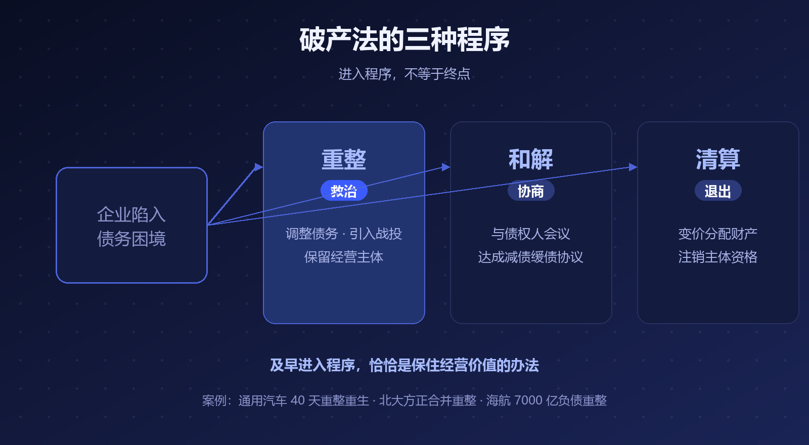
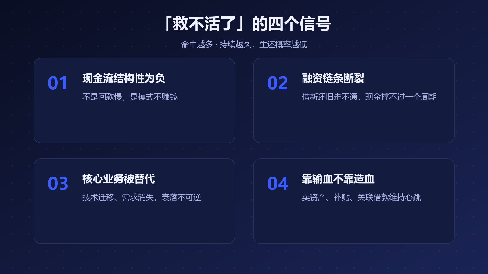
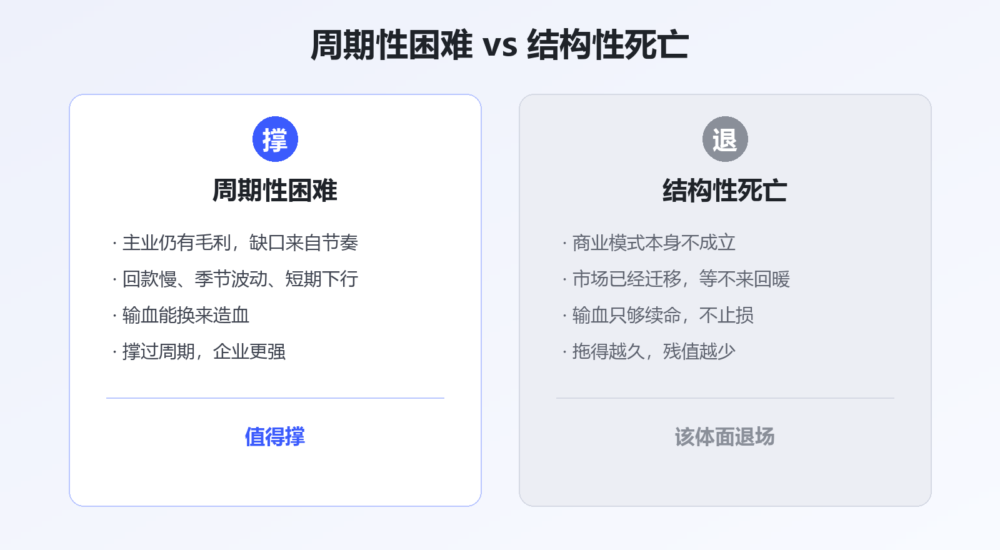

# 比破产更贵的，是硬撑

在中文商业语境里，"破产"是最忌讳的两个字。它被等同于失败、耻辱、社会性死亡。

但回看这些年最惨烈的商业败局，真正的问题往往不是企业破产了，而是**明明已经救不活了，还在硬撑**。

撑到资产缩水、撑到员工社保断缴、撑到供应商的货款变成坏账——最后轰然倒塌时，每一方受的伤都比及时止损重得多。

破产法从来不是死亡证明。它是市场经济给失败准备的**退出通道和重症监护室**。真正该被讨论的不是"要不要破产"，而是：**怎么判断一家企业已经救不活了？**

## 一、破产 ≠ 死亡：法律给了三扇门

《企业破产法》其实给了困境企业三条路：

▲ 图1 · 破产法的三种程序：进入 ≠ 终点

**重整**是救治——有挽救价值的企业在法院保护下调整债务、引入战投、保留经营主体。**和解**是协商——和债权人会议达成减债缓债协议。只有**清算**才是真正的退出。

看几个真实案例：

- **通用汽车**：2009 年 6 月 1 日申请破产保护时，总债务 1728 亿美元。40 天后，甩掉包袱的"新通用"成立，保住了核心业务和数万个岗位
- **北大方正**：2021 年 6 月，法院裁定批准五家公司实质合并重整，引入战投，这家背了巨额债务的校企获得了体面的新生
- **海航集团**：负债约 7000 亿元、中国迄今债务规模最大的破产重整案，通过重整拆分为四个独立板块分别处置，航空板块引入战略投资者后继续运营

这些企业都"破产"了，但都没死。**及早进入法律程序，恰恰是保住经营价值的办法。**

## 二、怎么判断"救不活了"：四个信号

法律标准写在破产法第二条：不能清偿到期债务，且资产不足以清偿全部债务或明显缺乏清偿能力。但对企业经营者，更早的预警信号在财务和业务里：

▲ 图2 · 判断企业难以继续存活的四个信号

**信号一：现金流是"结构性"为负，不是"周期性"紧张。** 这是最关键的分水岭——回款慢是周期问题，模式不赚钱是结构问题（下文详说）。

**信号二：融资链条断裂。** 借新还旧走不通了，评级下调、渠道关闭，账上的现金撑不过一个完整的生产周期。

**信号三：核心业务正在被替代。** 不是"今年管理没做好"，而是技术迁移、需求消失——胶卷之于数码，功能机之于智能机。这类衰落不可逆，不存在"熬过去"。

**信号四：靠输血，不靠造血。** 主业持续失血，靠卖资产、政府补贴、关联方借款维持心跳。报表活着，企业已经死了。

四个信号命中越多、时间越长，"救得活"的概率越低。

## 三、周期性困难 vs 结构性死亡：到底该不该撑

不是所有困难都该放弃。区分两种困境，是这篇文章真正的核心：

▲ 图3 · 值得撑的困难，与不该撑的死亡

**周期性困难值得撑**：主业还有毛利，缺口来自回款节奏、季节波动、行业短期下行；输血能换来造血，撑过周期企业更强。

**结构性死亡不该撑**：商业模式本身不成立，或市场已经迁移；输血只够续命，永远等不来"周期回暖"。

一个朴素的检验：**如果明天获得一笔大额注资，这家企业能靠经营自己活下去吗？** 能，是周期问题；不能，是结构问题。

## 四、硬撑的账单，从来不是老板一个人付

ofo 至今没有走完破产程序，上千万用户的押金悬置多年；乐视在最该止损的时点选择继续讲新故事，把供应商、员工和投资者越拖越深。

硬撑的本质，是**把企业主的沉没成本，转嫁给所有利益相关方**：

- 员工：欠薪、断保、职业空转
- 供应商：账款拖成坏账，拖垮上下游
- 债权人：资产在拖延中持续贬值
- 社会：僵尸企业占用信贷、土地和人才，挤占新企业的生存空间

这也是为什么"处置僵尸企业"会被写进国家供给侧结构性改革的重点——**让救不活的企业体面退场，本身就是资源配置的一部分。**

## 写在最后

创业者最大的勇气，不该只在坚持里，也该在止损里。

该重整时早一点进程序，资产还能卖上价钱，员工还能拿到补偿，债权人还能分到残值；拖到最后轰然倒塌，所有人才知道"体面"二字有多贵。

---

**参考资料**

- 《中华人民共和国企业破产法》第二条及重整、和解、清算程序规定
- 新华网：美国通用汽车申请破产保护，40 天完成重整（2009）
- 全国企业破产重整案件信息网：方正集团五家公司实质合并重整裁定（2021）
- 财新等：海航集团破产重整案相关报道（2021）

---

*本文由 AI 内容流水线生成，人工审核后发布。点个「在看」和「关注」，聊聊你见过的"硬撑"与"体面退出"。*
