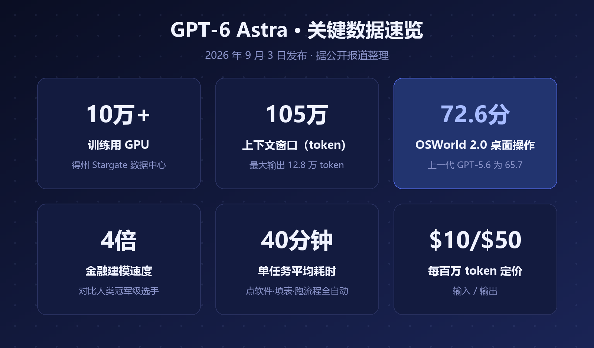
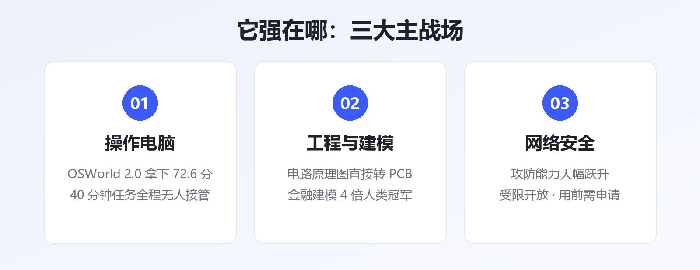
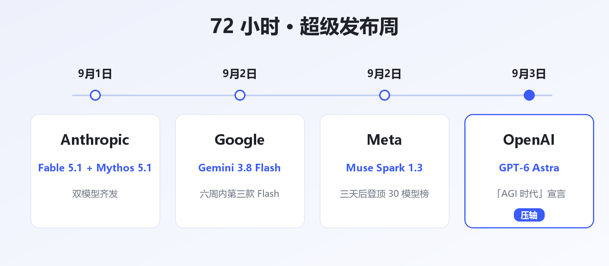
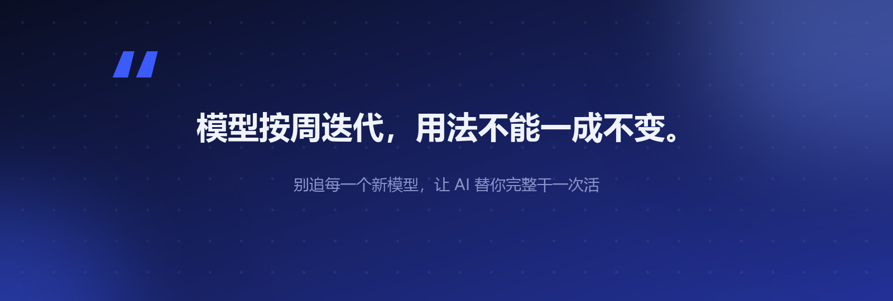

# GPT-6 Astra 发布：10 万张卡训练，OpenAI 宣称 AGI 时代到了

9 月的大模型圈有多疯狂？**72 小时里，四家顶级公司连发多款新模型**，发布密度创下历史纪录。

而压轴出场的 OpenAI，直接把调门拉满——9 月 3 日，旗舰模型 **GPT-6 Astra** 上线，发布语只有一句：

> Welcome to the AGI era.（欢迎来到 AGI 时代。）

AGI 时代真到了吗？先别急着激动，我们把这台"史上最贵模型"拆开看看。

▲ 图1 · GPT-6 Astra 关键数据速览（据公开报道整理）

## 一、先看账面：这次是真下了血本

三个数字，说明 OpenAI 这次押了多大的注：

- **10 万+ 张 GPU**：在得州 Stargate 数据中心完成训练，业内首次公开确认的十万卡级训练
- **105 万 token 上下文**：一次性读几十万字的中文资料毫无压力，最大输出 12.8 万 token
- **定价不便宜**：API 每百万 token 输入 10 美元、输出 50 美元，明摆着不是拿来闲聊的

一句话总结：**这不是聊天模型，是干活模型。**

## 二、凭什么敢说"AGI 时代"？

OpenAI 的底气，主要来自一项成绩：**操作电脑**。

在评测真实桌面任务的 OSWorld 2.0 上，GPT-6 Astra 拿到 **72.6 分**，上一代 GPT-5.6 Sol 是 65.7。一个平均 40 分钟的任务，它能自己点开软件、填表、跑完流程，全程不用人接管。

几个演示更夸张：把电路原理图直接转成可制造的电路板；金融建模的速度做到人类冠军选手的 **4 倍**；编程和网络安全能力也大幅跃升——其中网络安全相关能力因为"太能干"，OpenAI 采取了受限开放，要先申请才有权限。

这里藏着 2026 年竞争逻辑的变化：

> 上一轮卷的是"谁回答问题更聪明"，这一轮卷的是"**谁能替你把活干完**"。模型不再只是聊天框，而是坐在电脑前干活的"另一个员工"。

▲ 图2 · GPT-6 Astra 的三大主战场

## 三、真正的信号：王座没人坐得稳了

单看 GPT-6 Astra 确实强，但这个"超级发布周"更有意思的，是另外三家的动作：

▲ 图3 · 72 小时"超级发布周"时间线

- **Anthropic**（9月1日）：Claude Fable 5.1 和 Mythos 5.1 双发，Mythos 被评为当前最强前沿模型之一
- **Google**（9月2日）：Gemini 3.8 Flash 上线，六周内的第三款 Flash，摆明了高频快迭代
- **Meta**（9月2日）：Muse Spark 1.3 发布，三天后就登顶 30 款主流模型榜单（我们之前专门写过这篇）

结果就是：GPT-6 Astra 抢走了头条，但 9 月的榜单第一是 Meta。**没有一家坐得稳王座**——海外媒体的原话是"大模型王座不再稳固"，国内同行管这叫旗舰模型的"周抛时代"。

国产这边也没闲着：DeepSeek 更新了 V4 系列，还有爆料称 3 万亿参数的 DeepSeek Code 2.0 月内发布；阿里紧接着推出 Qwen 3.8-Max。发布节奏，明显在跟全球对表。

## 写在最后

对普通用户来说，这份"AGI 宣言"现阶段更像一个提醒：

**模型在按周迭代，你的使用方式却可能一年都没变过。**

不必每个新模型都去追，但值得挑一个真实的工作场景——写代码、做表格、跑流程——让 AI 完整替你干一次。哪天你发现"这活它干得比我还快"，AGI 对你来说，就算真的到了。

---

**参考资料**

- OpenAI 官网：《Path to Astra》《GPT-6 Astra：面向工作场景的下一代智能模型》（2026-09）
- CNET：GPT-6 Stole the Show, but Anthropic, Meta and Google Also Had New AI Models This Week（2026-09-03）
- DataCamp / The New Stack：GPT-6 Astra Benchmarks Explained（2026-09）
- 钛媒体·数智周报：OpenAI 发布 GPT-6 Astra 模型
- 知乎专栏：国内外知名大模型及应用盘点（2026-09-18）

---

*本文由 AI 内容流水线生成，人工审核后发布。觉得有用的话，点个「在看」和「关注」，每天一条 AI 圈有价值的动态。*
