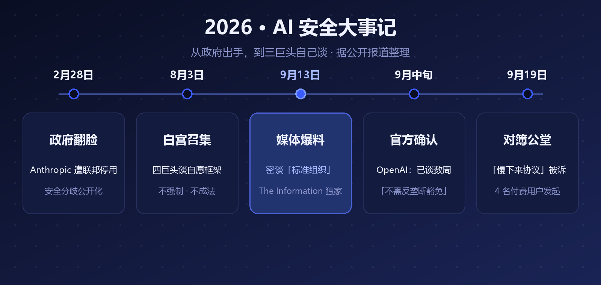
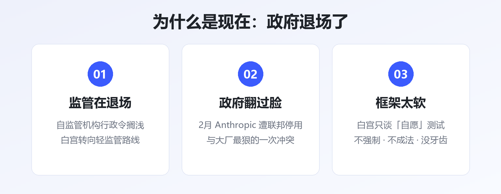
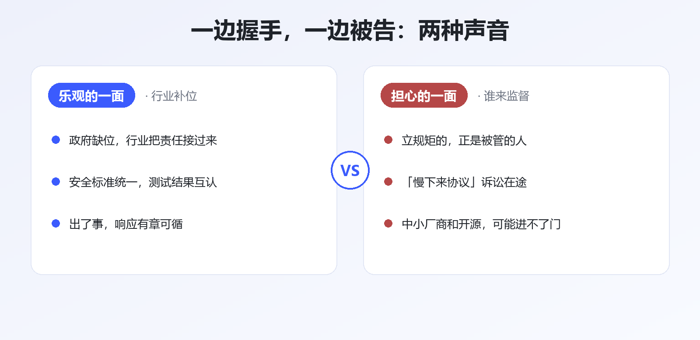

# 死对头同桌谈判：三巨头密建 AI 安全标准组织

大模型圈最戏剧性的一幕来了。

OpenAI、Google、Anthropic——过去两年在模型榜上杀得最凶的三家，最近被曝**正坐在一起，商量怎么给整个行业立规矩**。

据 The Information 9 月 13 日独家报道，三家已经秘密讨论多时，议题只有一个：**要不要联手成立一个 AI 行业的「标准组织」**。

随后 OpenAI 全球政策负责人公开确认：对话已持续数周。他还特意补了一句——**安全协调不需要反垄断豁免**。

先把话说在前头：死对头坐到一桌，从来不只是为了安全。

▲ 图1 · 从「被约谈」到「自己谈」：2026 年 AI 安全大事记

## 一、发生了什么

时间倒回一个半月前。

8 月 3 日，白宫把 OpenAI、Google、Anthropic、Meta 四家请去开会，讨论一套**自愿参与**的政府安全测试框架。注意两个词：自愿、框架——不是法律，不强制。

一个多月后，The Information 爆出更深一层：三巨头干脆自己谈起了行业标准组织——**测试怎么做、红线画在哪、模型放行前要过哪些关，都想自己定**。

Bloomberg 和 Reuters 随后跟进确认。也就是说，这事不是传闻，是正在进行时。

还有一项更具体的拟议协议被披露：**OpenAI 与竞争对手互相开放已商用模型的 API 权限**，专门用来给对方做压力测试——你帮我找漏洞，我帮你找隐患。竞争到刺刀见红的两家互开 API，这在科技行业历史上都罕见。

## 二、为什么是现在：政府退场了

▲ 图2 · 促成「三巨头同桌」的三个背景

答案有点反直觉：**不是监管来了，是监管走了。**

今年 2 月底，白宫下令联邦机构停用 Anthropic 的技术——起因正是安全分歧，这是政府和大厂翻脸最狠的一次。

到了 8 月，画风已经变成「轻监管」：行政令草案里原本想设一个 AI 自监管机构，结果**搁浅了**；会议开完，落地的只有一套自愿框架。

TechCrunch 的总结很直白：白宫正在淡化安全担忧、推动轻监管。

于是逻辑变成了：**政府不管，行业只好自己管。** 对三巨头来说，自己立规矩，总好过将来被别人立规矩。

## 三、最有意思的地方：一边握手，一边被告

▲ 图3 · 关于「安全联盟」的两种声音

就在谈判被曝光的同一时段，9 月 19 日，一纸反垄断诉讼递进了加州北区联邦法院：**4 名大模型付费用户**起诉 Anthropic、OpenAI、Google、xAI 四家，指控它们**达成了非法的「慢下来协议」——协同放慢各自的研发节奏**。

原告的逻辑并不复杂：打着「安全」旗号的协调，可能是横向垄断的新马甲——竞争对手约好一起慢，等于变相约好不让别人超车；而付了订阅费的用户，成了「集体慢下来」的买单者。

更微妙的是，Anthropic CEO Dario Amodei 早就公开承认过：这类安全协调**确实存在反垄断障碍**。老板自己都点过雷，难怪 OpenAI 的政策负责人要抢先声明「我们不需要豁免」。

另一边，Anthropic 9 月刚发布安全季报，晒出 2025 年 12 月以来阻断的网络攻击、生物滥用等七类威胁案例。安全工作是实打实在做的——**但「做安全」和「当裁判」，是两回事**。

## 四、接下来盯这三件事

1. **标准组织是否落地**：有没有正式名称、章程、成员名单——尤其是除了三巨头，谁被拉进来、谁被挡在门外
2. **「慢下来」诉讼走向**：如果法院认真审理，三巨头的安全协调方式可能被迫调整
3. **白宫自愿框架的命运**：会不会最终成文——政府想要的存在感，和行业标准组织怎么分工

对国内读者来说，这条新闻还有个隐藏看点：**中美走出了两条不同的路**。美国是政府退场、行业自律；国内是备案制加行业标准，政府主导。两条路线谁更能平衡「发展」和「安全」，未来几年会给出答案。

## 写在最后

死对头能坐到一桌，说明大家都意识到：**AI 这列火车开得太快，已经没有乘客敢赌它不出事。**

但历史经验是，行业标准组织一旦由头部玩家发起，规矩往往先服务立规矩的人。这次握手是行业的成人礼，还是巨头的新围墙——让子弹再飞一会儿。

---

**参考资料**

- The Information：Anthropic, OpenAI, Google Quietly Discussed an AI Safety Standards Body（2026-09-13）
- Bloomberg / Reuters：OpenAI Says It's Working With Anthropic, Google on AI Safety（2026-09）
- Quartz：OpenAI, Anthropic, Google DeepMind in AI safety talks for weeks（2026-09）
- Reuters / Bloomberg：四家 AI 公司赴白宫讨论自愿安全测试框架（2026-08-03）
- Courthouse News：Trump orders US agencies to stop using Anthropic technology（2026-02-28）
- CBS News / 新浪财经：4 名付费用户起诉四家 AI 公司「协同放缓研发」（2026-09-19/20）
- 钛媒体：OpenAI 与竞争对手的模型压力测试协议（2026-09）
- Anthropic：Detecting and Countering Misuse of AI（2026-09）

---

*本文由 AI 内容流水线生成，人工审核后发布。觉得有用的话，点个「在看」和「关注」，每天一条 AI 圈有价值的动态。*
